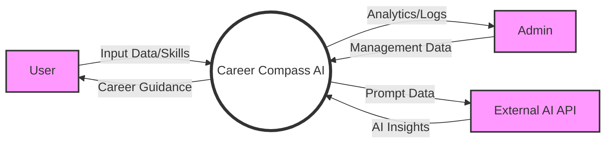

# Data Flow Diagram (DFD) Documentation

## 1. Introduction to Data Flow Diagrams

A Data Flow Diagram (DFD) is a fundamental visual and textual tool used in software engineering to illustrate how data moves through an information system. Unlike a flowchart, which focuses on the control flow and sequential steps of a process, a DFD focuses on the sources, destinations, and transformations of data. It provides a clear overview of the system's functional requirements by highlighting what data enters the system, how it is modified by various processes, and where it is eventually stored or output. DFDs are essential for documentation because they allow stakeholders—from developers to project managers—to understand the data dependencies and architectural boundaries of an application like **Career Compass AI**.

## 2. DFD Components and Symbolism

To maintain consistency and technical clarity, this DFD uses a standardized set of narrative components to describe the system's architecture. Each component serves a specific role in representing the data lifecycle:

- **Processes (The "How")**: These represent the transformations or manipulations of data. In a DFD, a process is an active component that takes input data, applies business logic or algorithms, and produces output data. In our system, these include tasks like "Analyze Skills" or "Generate Learning Path."
- **External Entities (The "Who")**: These are the actors or external systems that interact with Career Compass AI. They provide the initial data or consume the final results but are outside the system's direct control. Common examples include the end-user, system administrators, and external AI service providers like OpenAI.
- **Data Stores (The "Where")**: These are the passive repositories where data is held for later use. They represent persistent storage, such as relational databases (MySQL), in-memory caches (Redis), or specialized vector databases for AI embeddings.
- **Data Flows (The "What")**: These represent the movement of data between other components. A data flow describes the specific information being transferred, such as a "User Profile" moving from a form to the backend API.

## 3. Context Level Narrative (Level 0)

The Context Level Diagram provides a high-level summary of Career Compass AI's interaction with the outside world. This narrative examines the system as a single central process connected to its external stakeholders.

The primary data flow begins when a **User** interacts with the system via a web browser. The user sends a stream of input data, including their professional history, educational background, and skill assessment answers. In return, the system processes this input to deliver a comprehensive suite of career guidance, which includes personalized recommendations, skill gap visualizations, and detailed learning roadmaps.

Simultaneously, the **Administrator** interacts with the system to manage its operational parameters. The admin provides configuration data, such as new career domains, quiz questions, and learning resources. The system, in turn, provides the admin with detailed activity logs, performance metrics, and platform analytics to ensure the service remains effective and healthy.

Furthermore, the system maintains a critical data exchange with **External AI Services** (such as OpenAI's API). The system sends structured prompts and user data to the AI service and receives intelligently generated text, semantic analyses, and career insights that power the platform's core logic.

## 4. Process Decomposition Narrative (Level 1)

At Level 1, we decompose the system into its primary functional processes to understand how data is internally routed and transformed.

### 4.1 Authentication and Profile Management
When a user attempts to log in or update their profile, the data first passes through the **Authentication Process**. The user's credentials or profile updates are sent from the React Frontend to the FastAPI Backend. The system then queries the **MySQL Database** to verify identity or persist updated information. Once validated, a secure session token is generated and returned to the user, allowing for authorized access to the platform's premium features.

### 4.2 AI-Driven Skill Analysis and Career Guidance
The "brain" of the platform is the **AI Engine Process**. When a user requests a career analysis, their stored skills and goals are retrieved from the database and sent to this process. The AI Engine performs several key sub-tasks:
1. It interacts with the **Vector Store** to perform a semantic search, finding career paths that most closely match the user's current skill set.
2. It sends context-aware queries to the **External AI API** to generate high-fidelity gap analyses and personalized advice.
3. To ensure low latency for future interactions, the results of this analysis are temporarily cached in the **Redis Data Store**.
Finally, the processed results—including gap charts and recommended learning steps—are sent back to the user's frontend dashboard.

### 4.3 Administrator Control and Monitoring
The **Admin Management Process** handles the flow of architectural and educational data. When an administrator creates a new quiz or domain, this data is structured by the backend and written into the **MySQL Database**. Concurrently, system performance data and user interaction metrics are continuously captured by a **Monitoring Process**, which transforms raw logs into visual dashboards for the administrator to review and optimize.

## 5. Visual Summary (DFD Level 0)

While the narrative above provides the technical details, the following diagram offers a visual representation of the Context Level (Level 0) interactions.

## 6. Conclusion

The Data Flow Diagram documentation for Career Compass AI illustrates a sophisticated and highly interconnected architecture. By tracing the journey of data from initial user input through AI-driven transformation to persistent storage, we ensure that the system remains robust, maintainable, and aligned with its core mission of providing intelligent career guidance.
