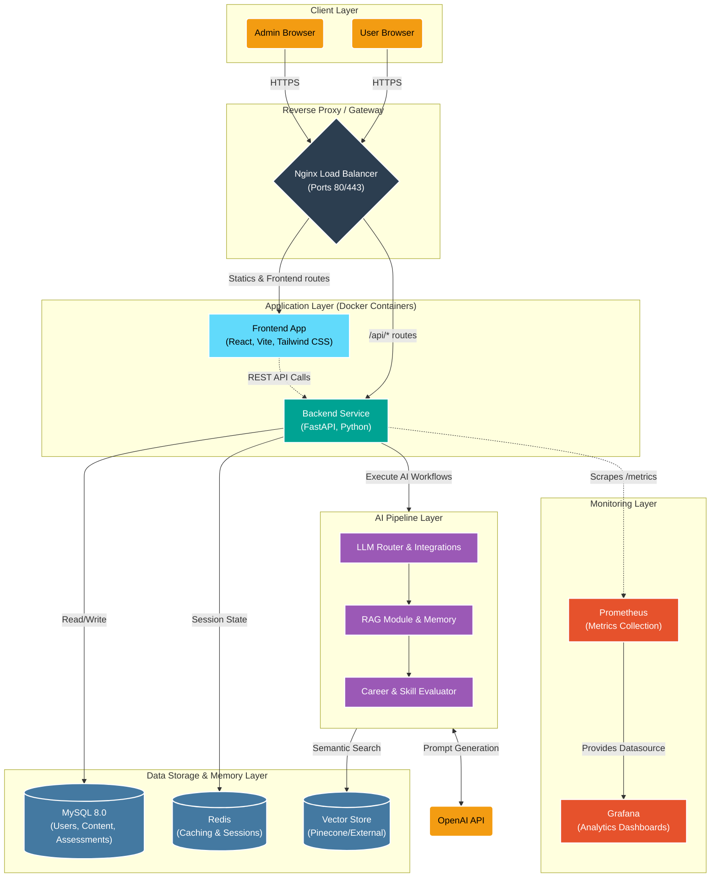

# Career Compass AI System Architecture

This interactive diagram provides a high-level overview of the Career Compass AI system architecture based on your project configuration and `docker-compose.yml`.

> [!NOTE]
> The diagram illustrates the exact technological stack you are using in this repository — React/Vite for the frontend, FastAPI for the backend Python service, MySQL 8.0 for relational storage, Redis for caching, Nginx for proxying, and Prometheus & Grafana for monitoring.

## Layers Breakdown

1. **Client & API Gateway**: External user requests are routed by an Nginx server, which maps domain routes cleanly to the frontend React bundle or the backend API APIs. 
2. **Application Core**: 
   - **Frontend**: A rich single-page application built with React and styled perfectly with Tailwind CSS.
   - **Backend API**: Driven by a fast, asynchronous FastAPI instance that handles robust routing (authentication, profile info, learning paths, quizzes).
3. **AI Pipeline**: The intelligent component of the tool. Leverages Python algorithms for mapping user skills to vector embeddings, finding matches using LLMs via OpenAI, and serving specialized RAG content to guide career decisions.
4. **Data Infrastructure**: Persistent and relational states are safely captured in a robust MySQL 8.0 database, while Redis drives low-latency operations such as chat sessions. 
5. **Observability**: Prometheus captures performance metrics continuously being presented logically via Grafana.
