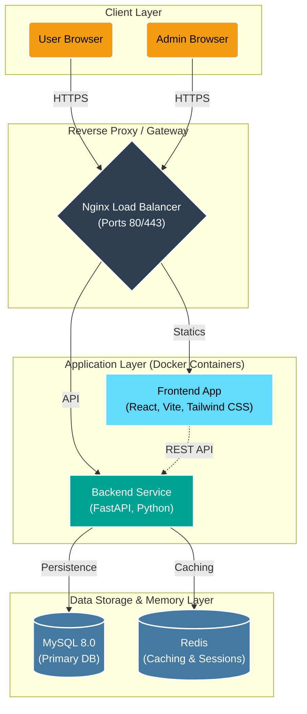

# 🏗️ Career Compass AI System Architecture

I have generated two versions of the system architecture for your project: a high-fidelity **visual diagram** for presentations and a **technical Mermaid diagram** for your documentation.

## 🖼️ Visual Architecture Diagram

This high-fidelity image represents your modern tech stack (React, FastAPI, MySQL, Redis, AI Core, and Monitoring) in a premium, isometric dark-mode aesthetic.

> [!TIP]
> This flat diagram is designed for technical documentation, clearly showing the service boundaries and data protocols.

---

## 🎨 Visual Architecture Diagram (Isometric)

For presentations and high-level overviews, this high-fidelity isometric version represents your modern stack.

---

## 📊 Technical Architecture (Mermaid)

The following diagram is also available in [system_architecture.md](file:///C:/Users/windows-11/.gemini/antigravity/brain/131e2afb-bd36-4faa-8984-b62be400d2e1/system_architecture.md). It details exactly how your Docker services communicate.

## 🛠️ Summary of Technologies Represented
- **Frontend**: React 18, TypeScript, Vite, Tailwind CSS.
- **Backend**: FastAPI, Python 3.11, SQLAlchemy.
- **AI Core**: OpenAI GPT-4 integrations, RAG (Retrieval Augmented Generation).
- **Core Infrastructure**: Docker Compose, Nginx (Reverse Proxy).
- **Data Persistence**: MySQL 8.0.
- **Caching**: Redis 7.2.
- **Observability**: Prometheus & Grafana.

---
> [!NOTE]
> All architectural insights were gathered directly from your project's `README.md`, `docker-compose.yml`, and source code.
